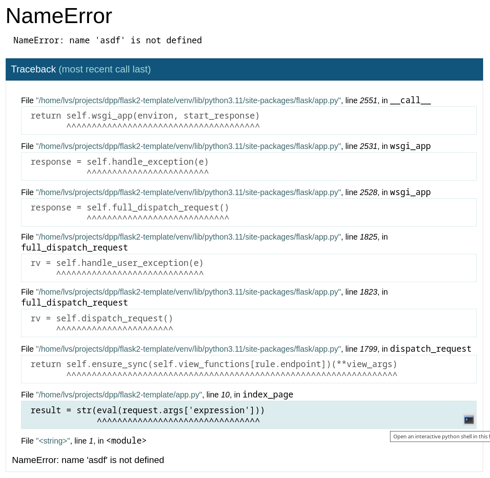

# Flask-2

## Предварительные шаги

1. Прочитайте [конспект о синтаксисе шаблонов Jinja](./jinja.md)

2. Откройте каталог проекта в редакторе VS Code

3. Создайте виртуальное окружение

4. Активируйте виртуальное окружение

5. Установите библиотеку Flask

## Отладка во Flask

1. Создайте файл `app.py` и добавьте в него следующий код:

```python
from flask import Flask, render_template, request

app = Flask(__name__)


@app.route("/")
def index_page():
    result = ""
    if 'expression' in request.args:
        print("================================================================================")
        print(request.args)  # Печать отладочного сообщения
        print("================================================================================")
        app.logger.warning(request.args)  # Печать отладочного сообщения
        print("================================================================================")
        result = str(eval(request.args['expression']))
    return render_template("index.html", result=result)
```

2. Создайте каталог `templates`, создайте в нем файл `index.html` и добавьте в него следующий код:

```html
<!DOCTYPE html>
<html lang="ru">
<head>
    <meta charset="UTF-8">
    <meta name="viewport" content="width=device-width, initial-scale=1.0">
    <title>Учебный сайт</title>
</head>
<body>
    <h1>Добро пожаловать!</h1>
    <form>
        <label>Введите арифметическое выражение (например 2+3):</label>
        <input type="text" name="expression">
        <input type="submit" value="Вычислить">
    </form>
    <p>Результат: {{ result }}</p>
</body>
</html>
```

3. Включите отладочный режим во Flask

Если вы используете PowerShell:
```powershell
$ENV:FLASK_DEBUG=1
```

Если вы используете командную строку:
```cmd
set FLASK_DEBUG=1
```

4. Запустите сервер и обратите внимание на наличие PIN для запуска отладки

```powershell
flask run
```

5. Откройте в браузере адрес [127.0.0.1:5000](http://127.0.0.1:5000) либо [localhost:5000](http://localhost:5000) и убедитесь, что в браузере отображается форма для ввода арифметического выражения.

6. Введите некорректное выражение, вы должны увидеть подобное окно:



7. Откройте консоль с запущенным сервером Flask, проверьте что в ней видны отладочные сообщения со значением переменной `request.args`. Сделайте скриншот и сохраните его в каталоге проекта.

8. Вернитесь в браузер, наведите курсор на выделенную строку, нажмите на кнопку с иконкой черного экрана и введите PIN отображаемый в консоли при старте сервера (см. п.4):

9. В открывшемся терминале введите название переменной `request.args` и убедитесь что оно отображает аргументы запроса. Сделайте скриншот и сохраните его в каталоге проекта.

10. Зафиксируйте изменения в новом коммите:

```powershell
git add .
git commit -m "Check Flask debug mode"
```

## Добавление иконки сайта и статических файлов

1. Создайте каталог `static`

2. Найдите сайт с примерами иконок сайтов ([например этот](https://icons8.com/icons/set/favicon-ico), [или этот](https://www.iconfinder.com/search?price=free&license=gte__1)), выберите подходящую, скачайте в формате `ico` и сохраните его в каталог `static` под именем `favicon.ico`.

3. Добавьте тег `link` в тег `head`:

```html
<link rel="icon" href="{{ url_for('static', filename='favicon.ico') }}">
```

4. Выберите на своем компьютере или в Интернете подходящую картинку и сохраните её в каталоге `static` (в имени файлов не должно быть русских букв, пробелов или специальных символов).

5. Добавьте тег `img` в тело HTML-страницы и замените имя файла:

```html
') }}">
```

6. Проверьте отображение иконки сайта и картинки через браузер.

7. Зафиксируйте изменения в новом коммите:

```powershell
git add .
git commit -m "Add favicon and picture to static files"
```

## Дополнительные эндпойнты

1. Добавьте функцию в `app.py` и допишите названия месяцев в список `months`:

```
@app.route('/table/')
def table_page():
    return render_template('table.html')
```

2. Добавьте шаблон `table.html`:

```html
<!DOCTYPE html>
<html lang="ru">
<head>
    <meta charset="UTF-8">
    <meta name="viewport" content="width=device-width, initial-scale=1.0">
    <title>Учебный сайт</title>
</head>
<body>
    <h1>Таблица умножения</h1>
    <table>
        
        <tr>
            
            <td>
                <a href="{{ url_for('result_page', x, y) }}">
                    {{ x }} &times; {{ y }}
                </a>
            </td>
            
        </tr>
        
    </table>
</body>
</html>
```

3. Добавьте ссылку в шаблон `index.html`:

```html
<a href="{{ url_for('table_page') }}">Таблица умножения</a>
```

4. Добавьте функцию в `app.py` и допишите названия месяцев в список `months`:

```
@app.route('/result/')
def result_page():
    return render_template('result.html')
```

5. Добавьте шаблон `result.html`:

```html
<!DOCTYPE html>
<html lang="ru">
<head>
    <meta charset="UTF-8">
    <meta name="viewport" content="width=device-width, initial-scale=1.0">
    <title>Учебный сайт</title>
</head>
<body>
    <h1>Результат</h1>
    <p><a href="{{ url_for('index_page') }}">Главная</a></p>
    <p><a href="{{ url_for('table_page') }}">Таблица умножения</a></p>
    <p>{{ x * y }}</p>
</body>
</html>
```

## Наследование шаблонов
